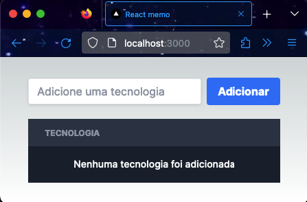
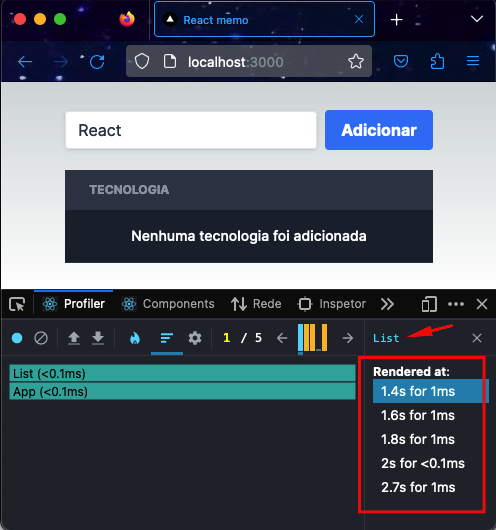
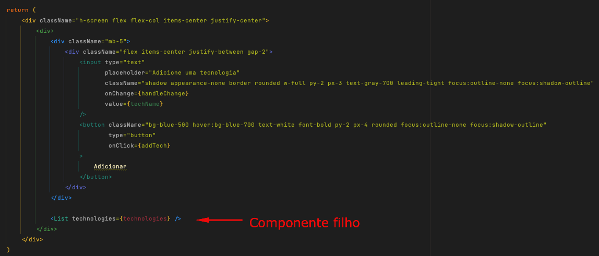
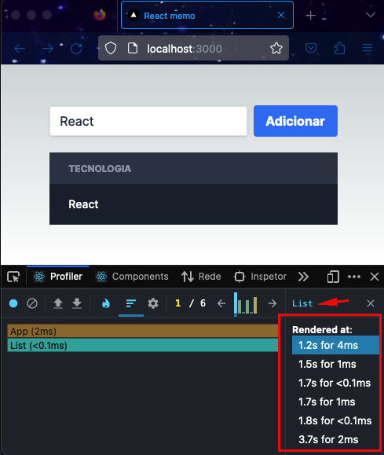
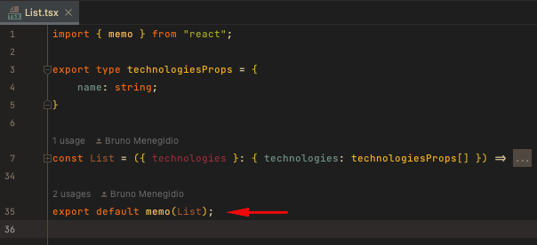
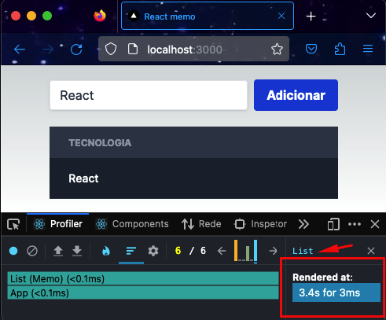

# react-memo

## Motivo
Demonstrar por meio de um app simples como otimizar um componente [react](https://react.dev/), evitando renderizações desnecessárias e dessa forma, melhorar o desempenho.

> Nesse outro repositório: https://github.com/bmenegidio/react-uncontrolled-input-render-optimization, resolvi um problema parecido utilizando **uncontrolled inputs**.

## O problema
Após executar o comando `npm run dev` e acessar o seguinte endereço no browser `http://localhost:3000/`, você verá a seguinte tela:

É um app simples, possui uma lista com nomes de tecnologias e um input e botão para adicionar novos nomes.
Porém, ao digitarmos "React" no input e analisarmos o profiler com a extensão _React Developer Tools_, podemos observar que a lista foi renderizada 5 vezes:

Mas por que isso acontece?
A lista foi renderizada 5 vezes, porque o estado do componente pai "App" foi alterado. E sempre que um componente pai é alterado os filhos também são renderizados novamente.
Podemos ver a estrutura do código abaixo:

E se digitarmos "React" e clicarmos no botão "Adicionar"?

 

Como podemos ver, 6 renderizações. Porém, 5 delas são desnecessárias.
Deveria ter ocorrido apenas 1 renderização do componente "List" ao clicar no botão "Adicionar", porque de fato a lista só foi alterada quando adicionamos 1 elemento nela.

Agora imagine o cenário onde esse componente "List" é um componente complexo, composto de textos, imagens e subcomponentes.
Isso significa que pra cada tecla digitada, essa lista complexa seria renderizada "n vezes" de forma desnecessária.
E como podemos resolver esse problema de desempenho?

## Uma solução
Podemos envolver a exportação do componente "List" com o **memo**.

Dessa forma dizemos ao React para criar uma versão memorizada (cacheada) desse componente "List" sempre que alguma prop (no caso, technologies) mudar.
Então mesmo que o componente pai "App" mude o estado, o componente filho "List" não serã renderizado novamente.
Só haverá uma renderização na lista quando a prop "technologies" for alterada.

Então ao executarmos o mesmo teste feito alteriormente, digitamos "React" e clicamos em "Adicionar". Vemos que só houve 1 renderização no componente "List".

